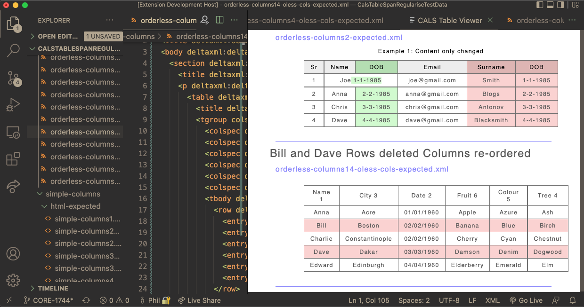

# CALS Table Viewer for Visual Studio Code #

A dedicated file viewer that renders CALS tables found in any XML file (or directory) opened in VS Code. 
The viewer highlights differences in the tables identified by DeltaXML's [DeltaV2 Markup](https://docs.deltaxml.com/support-and-documentation/2022-03-08/(2022-03-08)-Two-and-Three-Document-DeltaV2-Format.2887811091.html).

## Features
- Visually verify the validity of CALS tables
- See differences in CALS table content
- Infer differences in CALS table structure
- Understand the effect of different DeltaXML comparison settings
- With the file-watcher, continuously track the state of one or more CALS tables files
- A VS Code message displays any CALS table processing errors

## Getting Started
1. Launch VS Code and install the `CALS Table Viewer` extension
2. In VS Code, open an XML file containing CALS tables
3. From the Command Palette (**⇧⌘P**), invoke `CALS viewer: File (append)`
	- A **CALS Table Viewer** Pane is shown alongside the current view
	- CALS tables found in the file are rendered with basic styling
4. Open further XML files to append to the current view
	- Each file view in the pane is identified by a header with the filename

## Commands

| Command  | Description |
| ------- | ------- |
| `CALS Viewer: File (append)` | Appends new file content to previous file content each time a new file is selected |
| `CALS Viewer: File (replace)` | Shows the current file content each time a new file is selected |
| `CALS Viewer: Directory` | Shows the content of all files in the same directory as the currently selected file |
|||

## Behaviour Detail

Change the `CALS Viewer` type by running a different CALS Viewer command. To reset the `File (append)` view, close the current CALS Viewer first.

The CALS Viewer updates the view each time any of the underlying files is updated.

If non-XML (or not well-formed) files are opened, a section for the file is added to the view but no file contents is rendered.

*Note: the focus of the `CALS Viewer' project is just CALS tables and text content. Content found outside CALS tables is not styled.*

## Project Goals

This project started as a (four-day) DeltaXML 'free-sprint' project. There are two main goals for this project:

1. Provide a developer tool to help with analysing results from CALS table processing
2. Demonstrate how XSLT 3.0 and Saxon JS can be used to enhance data visualisation inside Visual Studio Code.

---
## Development Setup

*Note: Install **NodeJS** if it's not already installed*

### 1. VS Code Extension Setup

- Open in VS Code 1.47+
- `npm install`
- `npm run watch` or `npm run compile`
- `F5` to start debugging

### 2. Editing/Compiling XSLT in VS Code

This project uses XSLT and the SaxonJS XSLT processor to convert CALS tables to HTML that is shown in a VS Code **WebView**.
SaxonJS uses a compiled form of XSLT. To generate this from the `style-tables.xsl` source:

1. From the Command Palette, invoke **Run Task**
2. Select `Compile style-tables.xsl` from the task list

### 3. Technical Detail

**Coding and Security**

- This extension uses the VS Code [WebView API](https://code.visualstudio.com/api/extension-guides/webview) to render the CALS tables.
- An HTML content security policy is used to ensure scripts can only access file system resources that are explicitly listed. 

**WebView Messages**

The WebView and Visual Studio Code environment communicate in both directions via JSON messages. For example:

- A message is sent to the WebView when the active editor changes
- A message is sent from the WebView when an XSLT processing error is enountered
